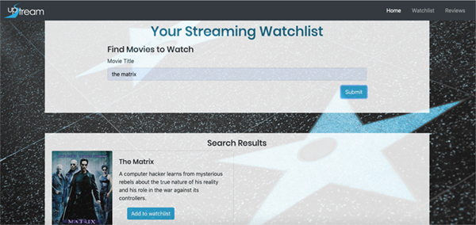
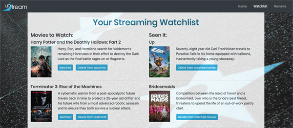
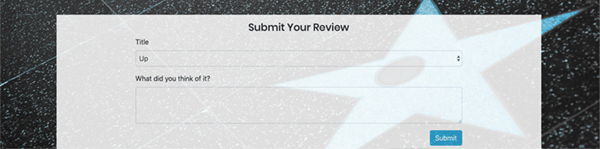
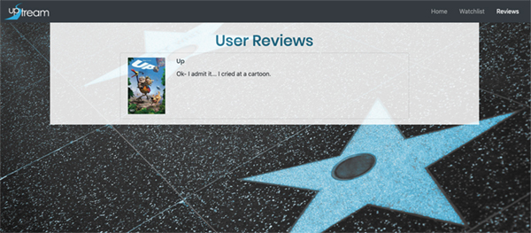

# UpStream

UpStream is a movie watchlist app that allows users to search for movies, add them to a watchlist, mark a movie as watched, and write a review.

## Getting Started
To start the app on a development server clone the repo and run npm install. Then use the schema.sql file to create the database in MySQL Workbench. Run npm start to start up the development server.

### Prerequisites
Sign up for an API key from OMBD: https://www.omdbapi.com/apikey.aspx and add to .env file as omdb_Key=[your key].

## Technology Used:
* API: OMDB
* Node JS
* Express
* MySQL and Sequelize
* Handlebars
* jQuery
* Bootstrap
* AOS (Animate on Scroll library)

Heroku URL: https://project-2jjmr.herokuapp.com/

## Landing Pages:
    

    Home:
        Nav Bar
        Search Bar
        Search Results

    Watchlist:
        List of Watched Movies
        List of Unwatched Movies
        Form to submit a review

    Modules for different movies:
        -Title
        -Info
        -Cover
        -Watched Button

    Reviews:
        List of user reviews

## Home

## Watchlist

## Reviews

For Future Development:
* User login for user-specific watchlist and profile
* List of streaming services where movie is available
* Recommended/Popular Movies Reel